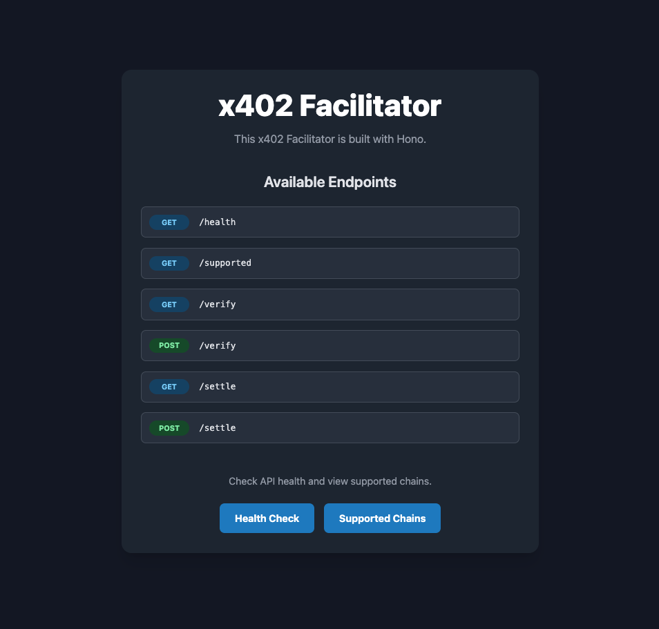

# x402 Facilitator

[](https://opensource.org/licenses/Apache-2.0)

A lightweight and efficient payment facilitator for the x402 standard, built with Hono. This server handles payment verification and settlement across multiple blockchains, including Solana and Base.



## ⚠️ Disclaimer and Important Notes

This project is a re-implementation of the official x402 facilitator example from Coinbase, which was originally written in Express. You can find the original example here:

- **[coinbase/x402/examples/typescript/facilitator](https://github.com/coinbase/x402/tree/main/examples/typescript/facilitator)**

This implementation is intended for **educational and demonstrational purposes only**. It serves as a learning resource for those who want to build their own x402 facilitator using Hono.

**Please DO NOT use this code in a production environment as-is.** Before considering deployment, you must thoroughly review and enhance the security, error handling, and overall robustness of the code to suit your specific needs.

While this application has been verified locally, **deployment to cloud platforms like Vercel has not been tested.** You will be responsible for any configurations and verifications required for a production deployment. **Use at your own risk.**

## ✨ Key Features

- **Blazing Fast**: Built on top of [Hono](https://hono.dev/), one of the fastest web frameworks for JavaScript.
- **Multi-Chain Support**: Seamlessly handles payments for Solana (Mainnet, Devnet) and Base (Mainnet, Sepolia).
- **x402 Compliant**: Implements `verify` and `settle` endpoints for the x402 payment standard.
- **Static Frontend**: A simple and informative landing page built with Hono's JSX and styled with Tailwind CSS.

## 🛠️ Tech Stack

- **Framework**: [Hono](https://hono.dev/)
- **Runtime**: [Node.js](https://nodejs.org/)
- **Language**: [TypeScript](https://www.typescriptlang.org/)
- **UI Styling**: [Tailwind CSS](https://tailwindcss.com/)
- **Testing**: [Vitest](https://vitest.dev/)
- **Package Manager**: [Yarn](https://yarnpkg.com/) (with Corepack)

## 🚀 Getting Started

Follow these instructions to get a copy of the project up and running on your local machine for development and testing purposes.

### Prerequisites

- [Node.js](https://nodejs.org/) (v20 LTS or later recommended)
- [Yarn](https://yarnpkg.com/) (enabled via Corepack)

### Installation & Setup

1.  **Clone the repository:**

    ```sh
    git clone https://github.com/snc2work/x402-facilitator-hono.git
    cd x402-facilitator-hono
    ```

2.  **Enable Corepack and set Yarn version:**
    Corepack is the modern way to manage package managers.

    ```sh
    corepack enable
    corepack use yarn@1
    ```

3.  **Install dependencies:**

    ```sh
    yarn install
    ```

4.  **Set up environment variables:**
    Create a `.env` file in the root of the project by copying the example file. It's recommended to create a `.env.example` file in your repository for others.
    ```sh
    cp .env.example .env
    ```
    Now, open `.env` and fill in the required values.

### Running the Development Server

To start the development server with hot-reloading:

```sh
yarn dev
```

The server will be running at `http://localhost:3004` (or the port specified in your `.env`).

## ⚙️ Environment Variables

The following environment variables are required for the application to run. Create a `.env` file in the project root.

```env
# Node environment (development, production, test)
NODE_ENV=development

# Server port (e.g., 3002)
PORT=3002

# Allowed origins for CORS (e.g., http://localhost:3000,https://example.com)
ALLOWED_ORIGINS=

# Comma-separated list of supported networks
SUPPORTED_NETWORKS=base,base-sepolia,solana,solana-devnet

# EVM private key for settling payments (e.g., 0x...)
EVM_PRIVATE_KEY=your-key

# SVM private key for settling payments (Base58 encoded)
SVM_PRIVATE_KEY=your-key

# -----------------------------------------------------------------
# Optional but Recommended: RPC URLs for Solana networks
# Public RPCs may be rate-limited. For reliable performance, especially on mainnet,
# it is highly recommended to use a dedicated RPC provider like Helius or QuickNode.
# -----------------------------------------------------------------
SOLANA_RPC_URL=
SOLANA_DEVNET_RPC_URL=
```

## 📜 Available Scripts

- `yarn dev`: Starts the development server with live reloading.
- `yarn build`: Compiles the TypeScript code and builds assets for production.
- `yarn start`: Starts the production server from the `dist` directory.
- `yarn test`: Runs the test suite using Vitest.

## 📡 API Endpoints

The server provides the following API endpoints. The root path (`GET /`) serves the HTML landing page.

| Method | Path         |
| ------ | ------------ |
| `GET`  | `/health`    |
| `GET`  | `/supported` |
| `GET`  | `/verify`    |
| `POST` | `/verify`    |
| `GET`  | `/settle`    |
| `POST` | `/settle`    |

## 📄 License

This project is licensed under the Apache License 2.0. See the [LICENSE](./LICENSE) and [NOTICE](./NOTICE) files for details.
